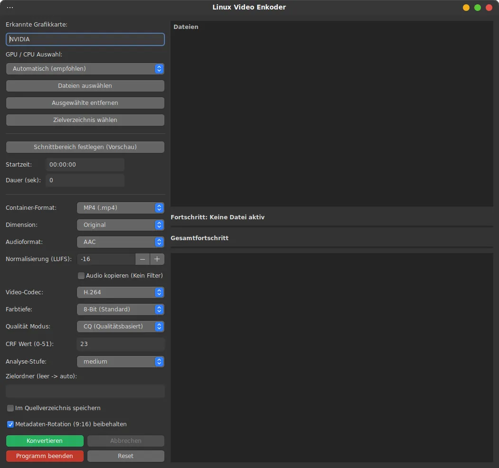
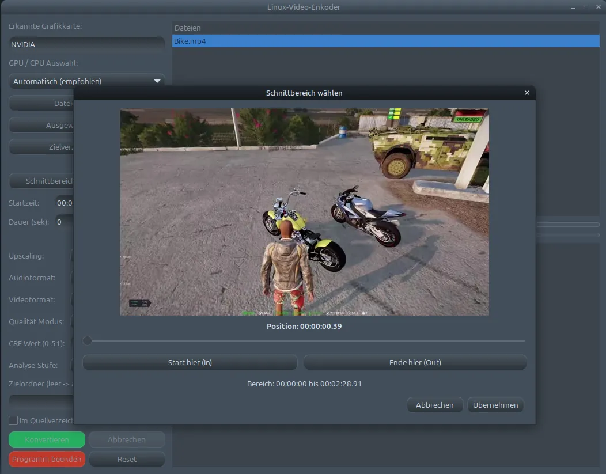

## Der Linux-Video-Enkoder
ist ein auf Linux ausgerichtetes Video-Verarbeitungstool, das dem Benutzer das Konvertieren von Video-Clips in andere Formate erleichtert. Es dient ferner der kompakten Speicherung großer Clips in platzsparenden Formaten und unterstützt jeweils den umgekehrten Prozess. Zur Beschleunigung der Arbeitsabläufe wird, sofern verfügbar, die vorhandene Hardware so weit wie möglich genutzt. Unterstützte Codecs sind H.264, H.265 und AV1. Die Konvertierung in AV1 bildet einen Sonderfall, da ältere Hardware diesen Codec möglicherweise nicht unterstützt. Falls keine Hardware-Unterstützung vorhanden ist, wird eine entsprechende Fehlermeldung ausgegeben; in diesem Fall ist jedoch eine Software-basierte Konvertierung weiterhin möglich.

<div style="display:flex; gap:10px;">
  
  
</div>

### Für eine einwandfreie Funktion muss ein aktueller Treiber und python3 installiert sein.

✅ Unterstützung: NVIDIA (NVENC); AMD (AMF/VAAPI); Intel (VAAPI); CPU (Software)\
✅ Der Audio-Codec im Videofile kann geändert werden: PCM 16bit, AAC, Flac\
✅ Der Audio-Codec im Videofile kann kopiert werden, praktisch z.B. 5.1 Audio\
✅ Konvertierung des Video-Files in h.264, h.265 oder AV1\
✅ Qualitätssteuerung: Auswahl nach CRF (Qualitätsstufe), fester Bitrate oder Ziel-Dateigröße (MB)\
✅ Skalierung: Hochwertiges Upscaling (720p bis 4K) via FFmpeg (Lanczos-Filter)\
✅ Batch-Verarbeitung: Unterstützung für Drag & Drop und gleichzeitige Auswahl mehrerer Dateien\
✅ Schnittfunktion: Visuelle Festlegung von Startzeit und Dauer über ein Vorschau-Modul\
✅ Prozesskontrolle: Echtzeit-Log-Fenster, Fortschrittsbalken und Abbruchfunktion\
***
### Funktionsübersicht
Die Software bietet umfangreiche Funktionen zur Video- und Audiokonvertierung unter Nutzung moderner Hard- und Software-Enkoder.

### Enkoder-Unterstützung
Für die Videokodierung stehen folgende Encoder zur Verfügung:\
    • NVIDIA: Hardwarebeschleunigung über NVENC\
    • AMD: Hardwarebeschleunigung über AMF bzw. VAAPI\
    • Intel: Hardwarebeschleunigung über VAAPI\
    • CPU: Softwarebasierte Kodierung ohne Hardwarebeschleunigung

Die Auswahl des Encoders erfolgt abhängig von der verfügbaren Hardware des Systems.   
Alternativ kann die Konvertierung per Software durchgeführt werden

### Videoformate
Das Quellvideo kann in eines der folgenden Zielformate konvertiert werden:\
    • H.264 (AVC)\
    • H.265 (HEVC)\
    • AV1  

### Audioeinstellungen
Der im Videofile enthaltene Audio-Codec kann unabhängig vom Videoformat geändert werden.\
Zusätzlich lässt sich auch nur der Audio-Codec ändern, wobei das Videoformat  nicht verändert wird.\
Audio-Copy (Stream Copy) 🆕: Die Audiospur kann ohne Neukodierung 1:1 in die Zieldatei kopiert werden.\
Dies spart Zeit und erhält die originale Qualität (z.B. bei 5.1 Surround-Sound)

Unterstützt werden:\
    • PCM (16 Bit)\
    • AAC\
    • FLAC (16 Bit) 

Die Lautstärke der Ausgabedatei kann nun angepasst werden.   
Es wird eine Normalisierung nach dem EBU R128 Standard (loudnorm) vorgenommen,\
das SpinButton-Feld fungiert dabei als Ziel-Lautstärke (LUFS). 

 • Standardwert: -24 (Der Rundfunkstandard, eher leise)   
 • Empfehlung für YouTube/Web: -14 bis -16 (schön laut, aber klar)    
 • Bereich: -30 (sehr leise) bis -5 (extrem laut)

### Qualität und Bitrate
Die Software ermöglicht:\
    • die Auswahl einer vordefinierten Qualitätsstufe\
    • die manuelle Einstellung der Zielbitrate\
    • die gewünschte Ausgabegröße  

### Auflösung und Skalierung
Es stehen folgende vordefinierte Zielauflösungen zur Verfügung:
    • 1280 × 720   (720p)\
    • 1920 × 1080 (1080p)\
    • 2560 × 1440 (1440p)\
    • 3840 × 2160 (2160p)

Die Skalierung erfolgt mittels FFmpeg unter Verwendung des Lanczos-Filters,  
um eine hochwertige Bildskalierung zu gewährleisten.
### Prozesssteuerung
Während der Konvertierung wird der aktuelle Fortschritt in einem separaten\
Fortschrittsfenster angezeigt, der Konvertierungsvorgang kann jederzeit durch\
den Benutzer abgebrochen werden.

### 🔍 Modul: Video-Vorschau & Frame-Extraktion (video_preview.py)
Die Datei video_preview.py dient als interaktive grafische Schnittstelle zur exakten Bestimmung von Schnittmarken. Anstatt Zeitstempel manuell schätzen zu müssen, ermöglicht dieses Modul eine visuelle Kontrolle in Echtzeit.

Kernfunktionen:
Frame-genaues Scrubbing: Über einen GTK-Schieberegler kann jede Position des Videos angesteuert werden. Für diese Funktion sollte sich nur ein Clip im Auswahlfenster befinden. 

Dynamic MJPEG Stream: Zur Ressourcenschonung und Vermeidung von Schreibzugriffen in geschützten Verzeichnissen (wie /usr/lib) nutzt das Modul eine FFmpeg-Pipe. Bilder werden direkt im Arbeitsspeicher als JPEG-Stream dekodiert und via GdkPixbufLoader angezeigt.

In/Out-Point Definition: Benutzer können Start- und Endpunkte visuell festlegen. Diese Werte werden beim Schließen des Dialogs automatisch an das Hauptprogramm übergeben.

Ressourceneffizienz: Das Modul nutzt Multithreading für die Bildextraktion, um ein Einfrieren der Benutzeroberfläche (GUI-Lag) während des schnellen Spulens zu verhindern.

## 🛠 Installation & Voraussetzungen
Das Programm ist ein Frontend für FFmpeg. Damit alle Funktionen (inklusive Hardware-Beschleunigung) reibungslos laufen, müssen die folgenden Pakete auf deinem System installiert sein.

### 1. System-Abhängigkeiten installieren
Für Ubuntu / Debian / Linux Mint:
```Bash
sudo apt update
sudo apt install python3-gi python3-gi-cairo gir1.2-gtk-3.0 ffmpeg
```
### 2. Hardware-Beschleunigung (Optional)
Um die GPU-Unterstützung zu nutzen, stelle sicher, dass die entsprechenden Treiber installiert sind:

NVIDIA: nvidia-utils und libva-nvidia-driver (oder die proprietären Treiber).\
AMD/Intel: libva-mesa-driver oder intel-media-driver.

Installieren kannst du den **Linux Video Enkoder**, nach dem Download des `.deb` Packages, von der **[Releases](https://github.com/Nightworker-DE/Linux-Video-Enkoder/releases)** Section in diesem Repository.


